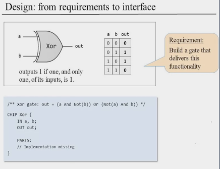
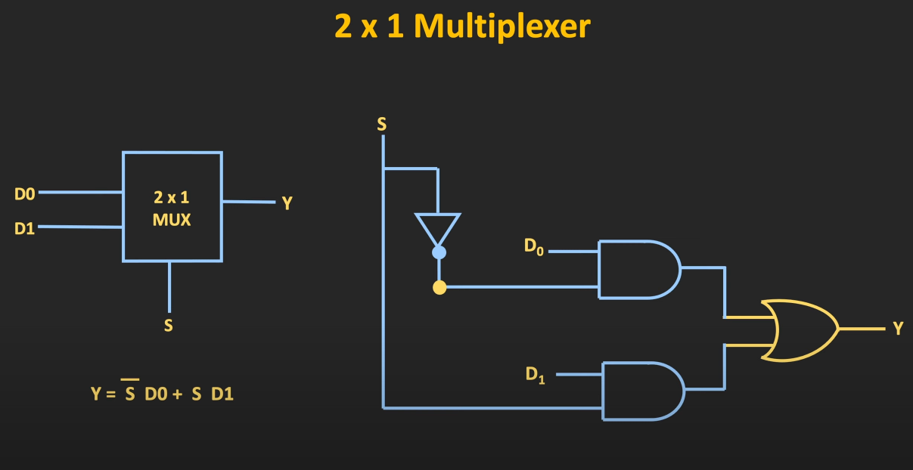

# Week 1
## Introduction
### Unit 0.0: Introduction

### Unit 0.1: The Road Ahead
- Don’t worry about the how worry about the what?
- Hello World, is kind of a simple program but not really at the same time. Since printing a text involves in changing the colours on a screen, sending these instructions to the “monitor”, etc.
### Unit 0.2: From Nand to Hack

### Unit 0.3: From Hack to Tetris
This lecture explains about the second part of this course. 
### Unit 0.4: Project 0 Overview

## Boolean Functions and Gate Logic
### Unit 1.1: Boolean Logic
AND, OR, XOR, NOT

What is nice about boolean functions is that they can only accept a constant number of inputs.
#### Boolean Identities
| Commutative Laws | Associative Laws | Distributive Laws | De Morgan Laws |
|------------------|------------------|-------------------|----------------|
|(x AND y) = (y AND x)|((x AND y) AND z) = (x AND (y AND z))|(x AND (y OR z)) = (x AND y) OR (x AND z)|NOT(x AND y) = NOT(x) OR NOT(y)|
|(x OR y) = (y OR x)|((x OR y) OR z) = (x OR (y OR z))|(x OR (y AND z)) = (x OR y) AND (x OR z)|NOT(x OR y) = NOT(x) AND NOT(y)|
|(x XOR y) = (y XOR x)|((x XOR y) XOR z) = (x XOR (y XOR z))|(x XOR (y AND z)) = (x XOR y) AND (x XOR z)||

### Unit 1.2: Boolean Functions Synthesis
> Key idea of this lecture is constructing the disjunctive normal form of a boolean function. DNF

The point is given a truth table construct a boolean function. That’s how logic gates are designed. For example a half adder.

For each of the 1s in a row we design a function that achieves a 1 on that row and 0 everywhere else. Then we OR all these expression together.

> Any boolean function can be represented using an expression containing AND, OR, and NOT operations. Actually we can do it with just AND and NOT operations. Because of de Morgan’s.

| x | y | NAND |
| --- | --- | --- |
|0|0|1|
|1|0|1|
|0|1|1|
|1|1|0|

> By only using NAND operation we can represent any boolean function.

### Unit 1.3: Logic Gates
Logic Gates:
- elementary ( nand, or, and)
- composite - made up from elementary logic gates or composite ones ( adder, Mux … )
#### Nand

Implementation is different than the interface. It is hidden, if we want to see it we have to explore the next level of the abstraction.

### Unit 1.4: Hardware Description Language

Implementation of a Xor logic with And, Not and Or gates.

All the connections need to be named.
Then in the PARTS section we describe all the connections coming in and out of individual gates.

As many gates/chips we have in our diagram we will have that many statements in the PARTS section. Inputs and outputs are already described in the IN and OUT sections.
HDL is a declarative language.

Before using a gate we need to know the gates interface/api and properly use it.

`Not(in= , out=), And(a= , b= ,out=), Or(a= , b= ,out=)`

VHDL and Verilog are the type of common hdls. There are many more.

### Unit 1.5: Hardware Simulation
Idea is to create an HDL code + test script load it into hardware simulator and test the logic.
Quite involved lecture. Mostly the idea is to explain the .hdl files.
.cmp files are used as a source of truth on how the logic should work. What outputs for which inputs.
.out is what your hdl program actually returns given a .tst file.
And a .tst file is sort of a script that instead of manually flipping bits let’s say it can do that for us, once we direct it how. For example we can say, change input a to 0 and input b to zero, then run simulation…

#### Unit 1.6: Multi-Bit Buses
As the name suggests we need these when manipulating bunch of bits together as one entity. Bunch of bits together are called a bus.

When we declare, `a[16]` that means a is a 16 bit bus. 

 
### Unit 1.7: Project 1 Overview

> Dmux and Mux gates should be reviewed.

| Elementary Logic Gates | 16-bit Variants |
| --- | --- |
| Not - First to implement, it is simple since `Not(a) = Nand(a, a)` | Not16|
| And - After implementing a not gate, it is easy since `And(a,b) = Not(Nand(a, b))` | And16|
| Or(a, b) = Not(Not(Or(a,b))) = Not(Nota And Notb) = Nota Nand Notb | Or16 |
| Xor - using dnf from the truth table of Xor `Xor(a, b) = And(a, not(b)) or And(not(a), b)` | Xor16 |
| Mux `if (sel == 0) out = a, else out = b Mux(a,b,s) = And(a, Not(s)) or And(b, s)` | Mux4Way16 |
| Dmux | |
 
 
### Unit 1.8: Perspectives

- we can build a computer with just nand gates or nor gates
- nmos implementation of a nand gate
