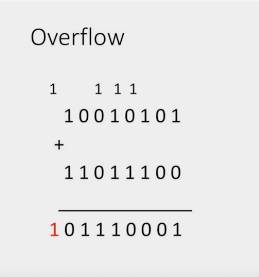
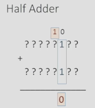
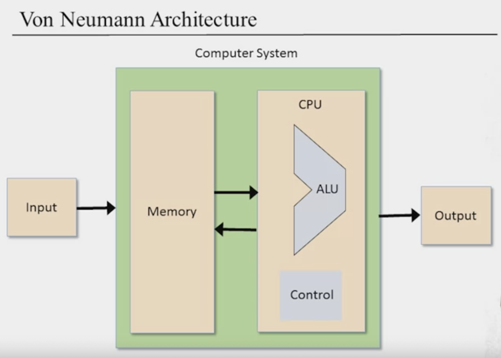
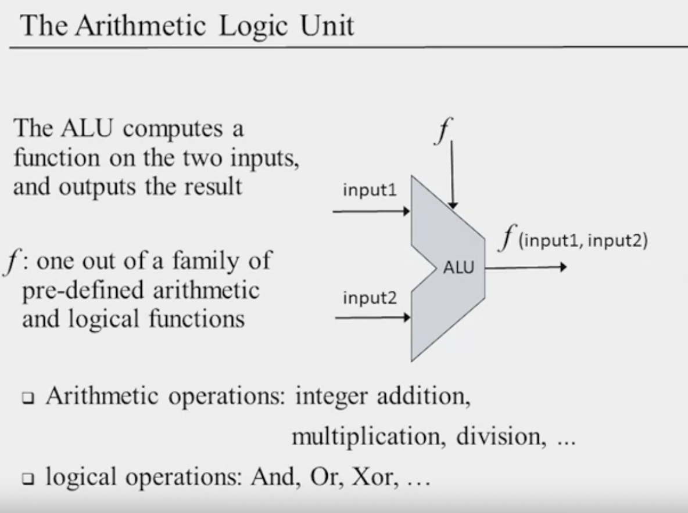
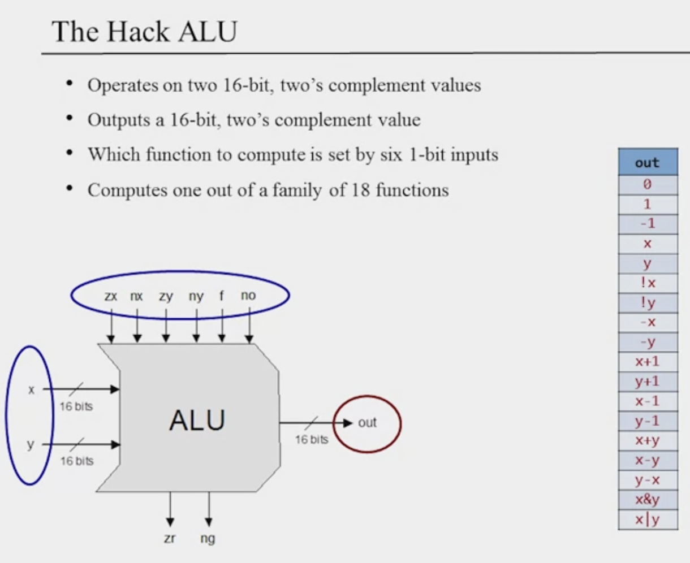
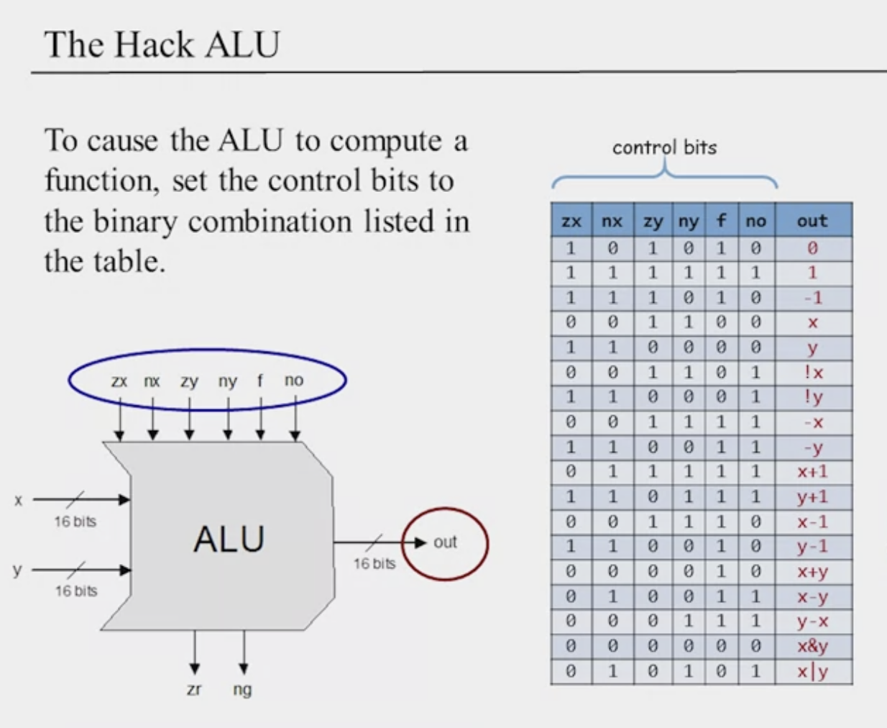

# Week 2

## Boolean Arithmetic and the ALU Roadmap

We will be focusing on creating adders, chips designed to add numbers. We will then build an ALU, which is designed to perform arithmetic and logical operations. Then a CPU from an ALU.
**Key concepts:** Binary numbers, binary addition, the two's complement method, half-adders, full-adders, n-bit adders, counters, Arithmetic Logic Unit (ALU), combinational logic.
### Unit 2.1: Binary Numbers
Nothing new here.
### Unit 2.2: Binary Addition
Addition we will implement in hardware. Then Subtraction and which is greater we get for free. Multiplication and Division will be implemented with software.

Addition is not really mathematical since if adding two numbers exceeds the words size, the computer will just  ignore the extra bits.

Build an Adder:
- Half adder - add two bits
- Full adder - adds three bits
- Adder - adds two numbers
#### Half Adder

As long as the carry from before was  a 0, then we just adding two bits. No matter what all the other bits in either number look like. So we will focus on that slice.
Implementing the half adder is very easy, one xor gate and one and gate.
| a | b | sum | carry |
| --- | --- | --- | --- |
| 0 | 0 | 0 | 0 |
| 0 | 1 | 1 | 0 |
| 1 | 0 | 1 | 0 |
| 1 | 1 | 0 | 1 |

#### Full Adder
Now we have three inputs, when we looking at a slice. We have the a, b but also c ( carry ).

| a | b | carryin | sum | carryout |
| --- | --- | --- | --- | --- |
| 0 | 0 | 0 | 0 | 0 |
| 0 | 0 | 1 | 1 | 0 |
| 0 | 1 | 0 | 1 | 0 |
| 0 | 1 | 1 | 0 | 1 |
| 1 | 0 | 0 | 1 | 0 |
| 1 | 0 | 1 | 0 | 1 |
| 1 | 1 | 0 | 0 | 1 |
| 1 | 1 | 1 | 1 | 1 |

[Full Adder using Half Adder](https://www.youtube.com/watch?v=Z_DYRgtAXfw)

> How to go from a half adder to a full adder can be done with figuring out the kmaps. And then sort of working it out by using half adders. The final diagram is two full adders and an or gate.

#### Multi-bit Adder

For example, a 16 bit adder will have one half adder for the right most bits. Then 15 full adders for the rest. We can also just do 16 full adders.

### Unit 2.3: Negative Numbers
#### Sign Bit
This representation is not popular. The first digit represents the sign only, the rest is about the magnitude. One shortcoming is that 0 and negative 0 have two different representations. Also adding a number with it’s complement through the usual digit wise addition does not produce 0.
#### Two’s Complement

> Idea: In order to represent (-x), we represent it as the positive number from calculating (2^n - x).

We get one extra negative number compared to the previous approach. 

> Having n bits to represent a number, we have 2^(n-1) - 1, positive numbers and, 2^(n-1) negative numbers.

Two’s complement allows us to get subtraction for free. Key idea here is to understand how to compute (-x), since y - x = y + (-x)

> `-x = 2^n - x = 1 + (2^n - 1) - x`, since `2^n - 1` is all 1s (111..11), subtracting a number from this is very easy since we never need to borrow. Then add one.

### Unit 2.4: ALU

> if out == 0 then zr = 1, else zr = 0

> if out < 0 then ng = 1, else ng = 0.

The reason for these will be apparent later when we build a whole computer.

### Unit 2.5: Project 2 Overview
Done completed.

### Unit 2.6: Perspectives
