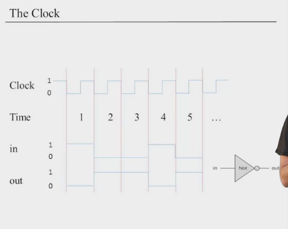
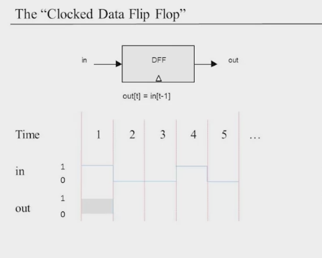
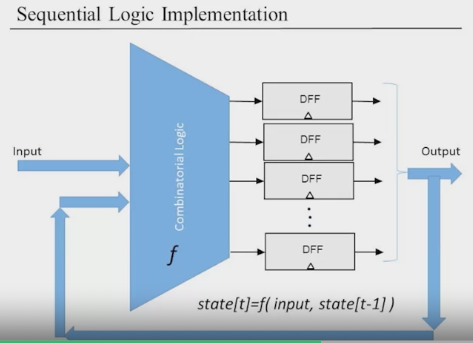
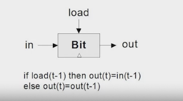

# Week 3
## Module 3: Memory Roadmap

### Unit 3.1: Sequential Logic

> Clocks in sequential logic, divide up the continuous time into discrete chunks or integer time units.

- Use the same hardware over time
	- Inputs change and outputs should follow
	- Let's take the example for an adder. We want to use this chip multiple times, not just once.

- Remember state
	- Memory
	- Counters

- Deal with speed

#### Combinatorial Logic vs Sequential Logic
- Combinatorial: `c = function(in[t])`
- Sequential: `out[t] = function(in[t - 1])`
	- The output at time t, depends on the input at time: t - 1

> In **combinatorial logic** we supply an input to a gate then the gate produces an output almost instantenously. But it will erase this output right away unless we keep supplying it the input. In **sequential logic** we want to keep state from time t - 1.

> **Combinatorial Logic** and **Sequential Logic** are two fundamental concepts in digital circuit design. In **Combinatorial Logic**, the output is determined solely by the current inputs. As soon as the inputs change, the output changes almost instantaneously. However, the output does not persist and will change or disappear unless the input is continuously supplied. On the other hand, **Sequential Logic** incorporates a concept of 'state'. The output is determined not only by the current inputs but also by the history of inputs. This allows the system to maintain a state or memory from previous time steps (t - 1), providing a form of memory in digital circuits.

### Unit 3.2: Flip Flops

#### Remembering State

- Missing ingredient: remember one bit of information from time (t - 1) so that it can be used later on.
- Gates that can remember and flip between two states are called flip-flops.

#### The Clocked Date Flip Flop or D Flip Flop

- Implementation of the D flip flop in this course will not be considered. We will assume that it is a primitive and a given.`

#### Remembering forever 1-bit Register

> Goal: Remember a 1-bit value until a new value is loaded.

Notice the difference in this context, between a d flip flop and load. d flip flop only remembers the state at time (t - 1), a load chip will remember the value forever, as long as no new load instruction is supplied (change the load input).

> In summary, a D flip-flop's output changes with each clock pulse, capturing the input value at that moment (t - 1), while a load chip's output remains constant until a new load instruction is given.
