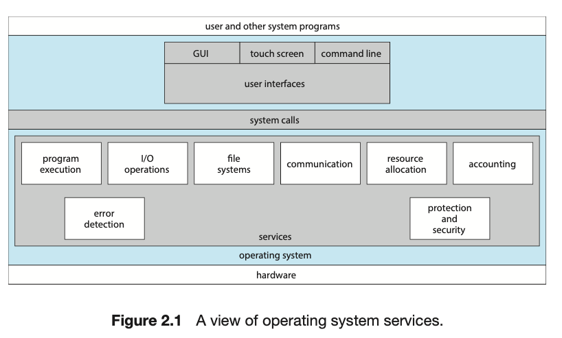

# Chapter 2 Operating-System Structures

## Chapter Objectives

## 2.1 Operating-System Services

## 2.3 System Calls

These calls are generally available as functions written in C and C++, although certain low-level tasks may have to be written using assembly language instructions.

> Relationship between a systemcall and api function (wrapper)

Two broad types of communication between two processes (message-passing model vs shared memory model)

